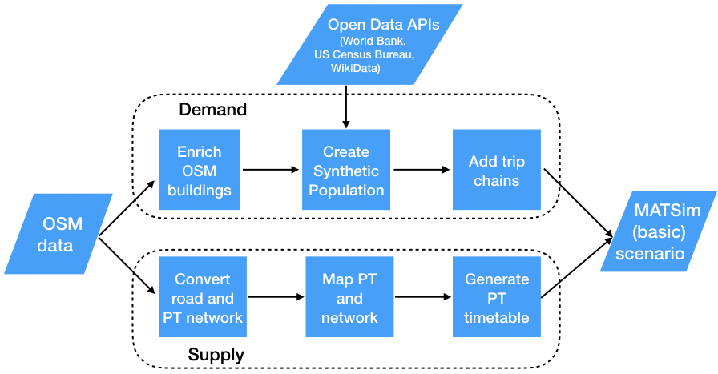

## Installation

Running the proposed framework requires Java 11 and Maven, besides a number of Python and R dependencies.

The Python and R dependencies are managed with conda (or rather much faster, mamba), so simply run: 
    
    mamba env create -f environment.yml

Note: there are many dependencies, and conda can be quite slow to install all of them, so mamba is suggested (`conda install mamba -n base`).

## Quick start

1. Download (or clone) the GitHub repository.
2. `mamba env create -f environment.yml` (make sure mamba is available in the base environment of conda)
3. `mamba activate matsim-toy` 
4. Run `python run.py city_name country_name sample_size target_path`

This will produce a MATSim toy model for *city_name* (part of *country_name*) with size population * *sample_size*, run it for 100 iterations and store everything in *target_path* (with default configuration). Default model creation configuration can be seen in the file `config_full.yml` and the default MATSim simulation configuration can be seen in `matsim/config.xml`.

Alternatively, create a `config.yml` file (e.g. by editing the existing one or `config_full.yml`) and run it with `python run.py config_path`.

Running the framework takes also some time, depending on the size of the scenario. The example provided is a 10% scenario for Luzern (Switzerland), a relatively small city with ~90’000 inhabitants, which takes about 11 minutes to build and 23 minutes to run 100 iterations in MATSim in a 16GB macOS i7.

## Configuration

The configuration for running the different steps is stored in a yml file. The example config.yml contains the configuration for the initial example and contains minimal configuration and only the final step, which means all other steps are run with default arguments. The config_full.yml on the other hand shows all steps available with their respective arguments. The argument values are the default so running the framework with config.yml and config_full.yml produces the same results, although running a second time would only trigger the last step in the former while re-running the entire pipeline in the latter.

## Alternative uses

The proposed framework’s intended use is mainly to create and run a toy MATSim scenario for any given city, but the steps implemented may be used in different ways and adapted to other needs. Most importantly, the scripts may be edited or replaced entirely in order to accommodate additional input data, still taking advantage of the other steps implemented and the pipeline’s chaining and caching capabilities.

## Assumptions and methods 

The detailed description can be found in the submitted [report](doc/Seminararbeit_Guggisberg_R1.pdf).
